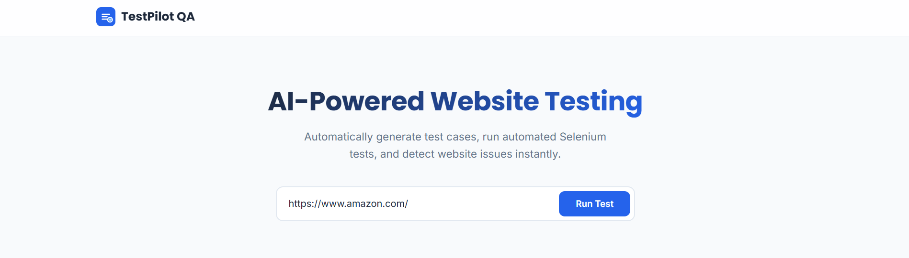
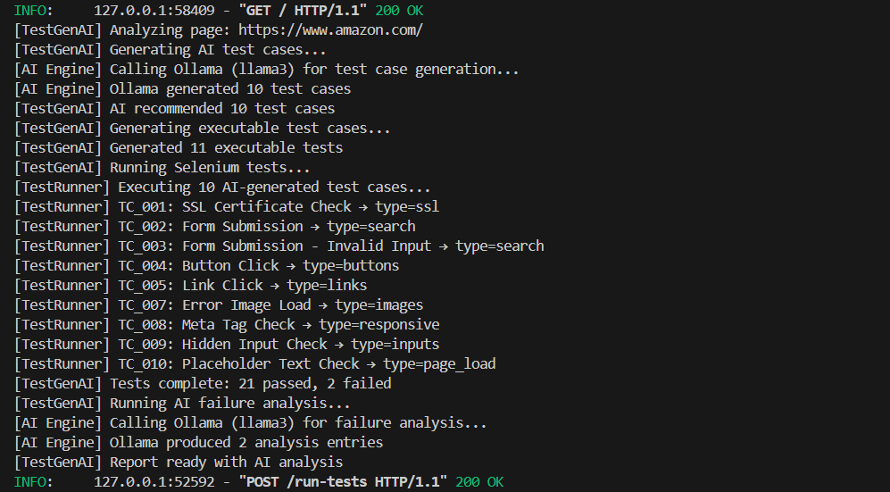
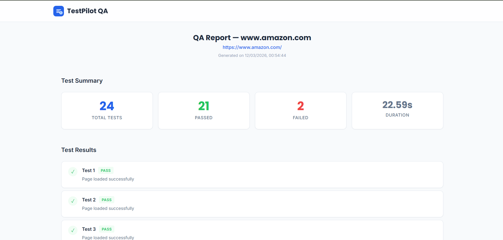
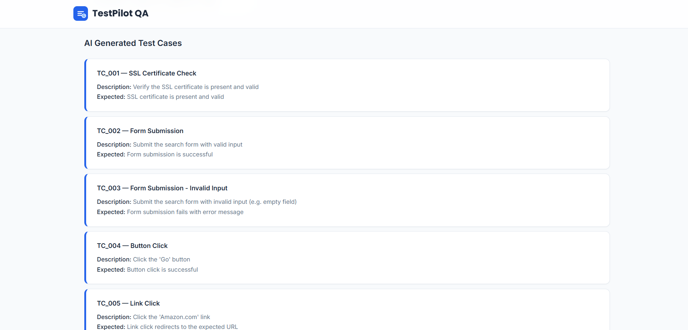
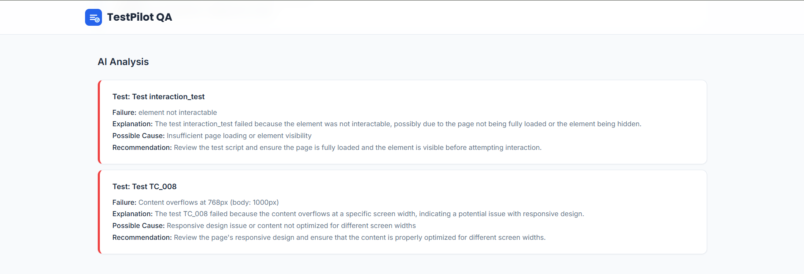

# TestPilot QA

### AI-Powered Website Testing Platform

TestPilot QA is an **AI-driven automated website testing platform** that analyzes web pages, generates intelligent test cases using **Llama3 (via Ollama)**, executes automated **Selenium tests**, and produces structured QA reports with **AI-generated failure explanations**.

The platform helps developers **automatically detect website issues** and reduce manual QA effort.

---

# Project Overview

Modern web applications require continuous testing to ensure reliability, usability, and performance. Manual testing is often repetitive and time-consuming.

**TestPilot QA automates this process using AI and browser automation.**

The system:

1. Analyzes website structure
2. Uses **Llama3 AI** to generate test cases
3. Executes tests using **Selenium**
4. Detects failures automatically
5. Captures screenshots of issues
6. Generates **AI-powered debugging explanations**

---

# Key Features

* AI-generated test cases using **Llama3**
* Automated browser testing using **Selenium**
* Failure screenshot capture
* AI-based failure explanation and debugging suggestions
* Modern **dashboard UI for QA reports**
* Dynamic website interaction testing
* Automated test metrics and execution summary

---

# Screenshots

## Landing Page

The landing page allows users to enter a website URL and run automated QA tests.



Users can quickly start automated testing by providing a website URL.

---

## Automated Browser Testing

Selenium automatically launches a browser and interacts with the website.


The system performs tests such as:

* Page load validation
* Button interaction testing
* Form submission validation
* Input validation
* Link navigation testing
* SSL certificate checks

---

## Terminal Execution Logs

The backend displays real-time execution logs during testing.



Example output:

```
[TestGenAI] Generating AI test cases...
[TestRunner] Executing AI-generated test cases
[TestGenAI] Tests complete: 21 passed, 2 failed
[TestGenAI] Running AI failure analysis
```

These logs help developers track the testing process.

---

## Test Results Dashboard

After execution, the platform generates a structured QA report.



The dashboard displays:

* Total tests executed
* Passed tests
* Failed tests
* Execution time

This provides a quick overview of website health.

---

## AI Generated Test Cases

TestPilot QA uses **Llama3** to generate intelligent QA scenarios based on the website.



Example test cases:

```
TC_001 – SSL Certificate Check
TC_002 – Form Submission
TC_003 – Invalid Input Validation
TC_004 – Button Click Interaction
TC_005 – Link Navigation
```

These tests simulate real user interactions.

---

## AI Failure Analysis

If a test fails, the AI explains the issue.



Example output:

```
Failure: Element not interactable

Explanation:
The element may be hidden or the page may not be fully loaded.

Recommendation:
Ensure the element is visible before interaction.
```

This helps developers **quickly understand and debug issues**.

---

# System Architecture

```
Frontend Dashboard
        ↓
FastAPI Backend
        ↓
Website Analyzer (BeautifulSoup)
        ↓
Llama3 via Ollama
        ↓
AI Test Case Generator
        ↓
Selenium Test Runner
        ↓
QA Report + AI Failure Analysis
```

---

# Tech Stack

### Frontend

* HTML
* CSS
* JavaScript

### Backend

* Python
* FastAPI

### Automation

* Selenium

### AI Integration

* Llama3 (Ollama)

### Web Parsing

* BeautifulSoup

### Other Tools

* webdriver-manager
* requests

---

# How the System Works

1. User enters a website URL.
2. Backend analyzes webpage structure.
3. Llama3 generates relevant QA test cases.
4. Selenium launches a browser and executes tests.
5. Failures are detected automatically.
6. Screenshots are captured for failed tests.
7. AI analyzes failures and generates explanations.
8. Results are displayed in the dashboard.

---

# Installation Guide

## Clone the Repository

```bash
git clone https://github.com/pb1803/TestPilot-QA.git
cd TestPilot-QA
```

---

## Create Virtual Environment

```bash
python -m venv venv
```

Activate environment

Windows

```
venv\Scripts\activate
```

Mac/Linux

```
source venv/bin/activate
```

---

## Install Dependencies

```bash
pip install -r requirements.txt
```

---

## Install Ollama

Download Ollama from:

```
https://ollama.ai
```

Run the Llama3 model:

```
ollama run llama3
```

---

## Start Backend Server

```
uvicorn backend.main:app --reload
```

Server runs at:

```
http://127.0.0.1:8000
```

---

## Run Frontend

Open the frontend file:

```
frontend/index.html
```

Enter a website URL and click **Run Test**.

---

# Example Output

```
Total Tests: 24
Passed: 21
Failed: 2
Execution Time: 22.59s
```

Example AI explanation:

```
Failure: Element not interactable
Possible Cause: Element hidden or page not fully loaded
Recommendation: Ensure element visibility before interaction
```

---

# Project Structure

```
TestPilot-QA
│
├── backend
│   ├── main.py
│   ├── ai_engine.py
│   ├── test_generator.py
│   ├── test_runner.py
│   └── report_generator.py
│
├── frontend
│   ├── index.html
│   ├── script.js
│   └── style.css
│
├── reports
│
├── requirements.txt
└── README.md
```

---

# Future Improvements

* Broken link detection
* Website performance testing
* Multi-page crawling
* CI/CD pipeline integration
* Self-healing test selectors
* Export QA reports as PDF

---

# Author

**Prajwal Bosale**
Computer Science Engineering Student

Interests:

* Artificial Intelligence
* Automation Systems
* Web Development
* Web3

---

# License

This project is for educational and research purposes.

---
